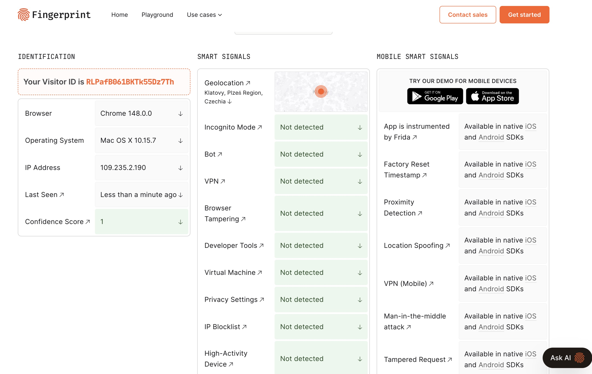
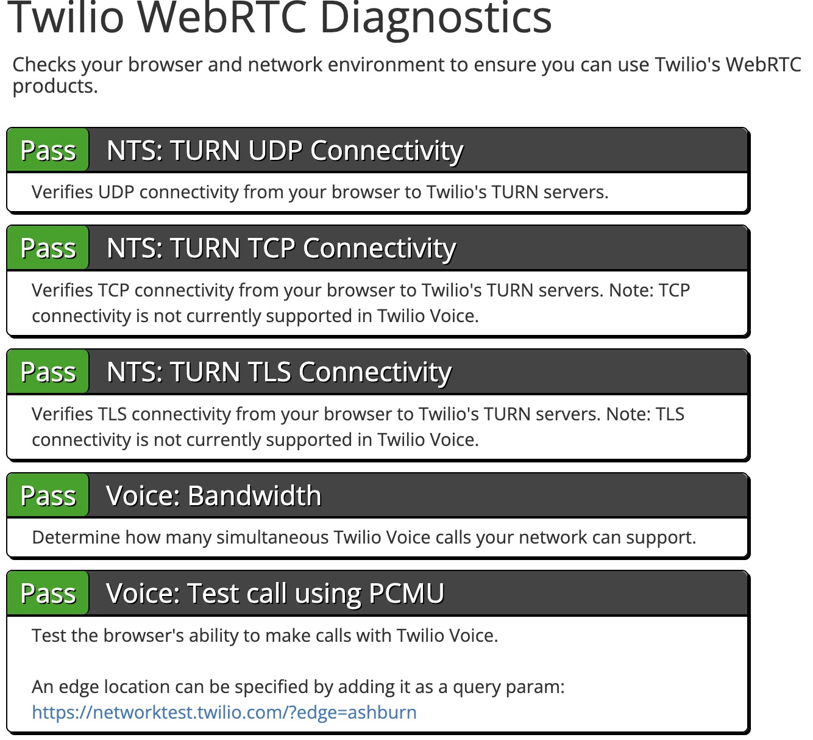
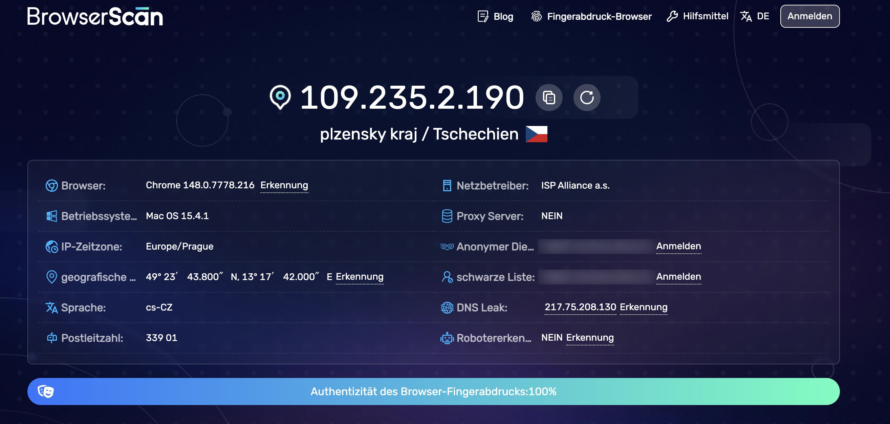
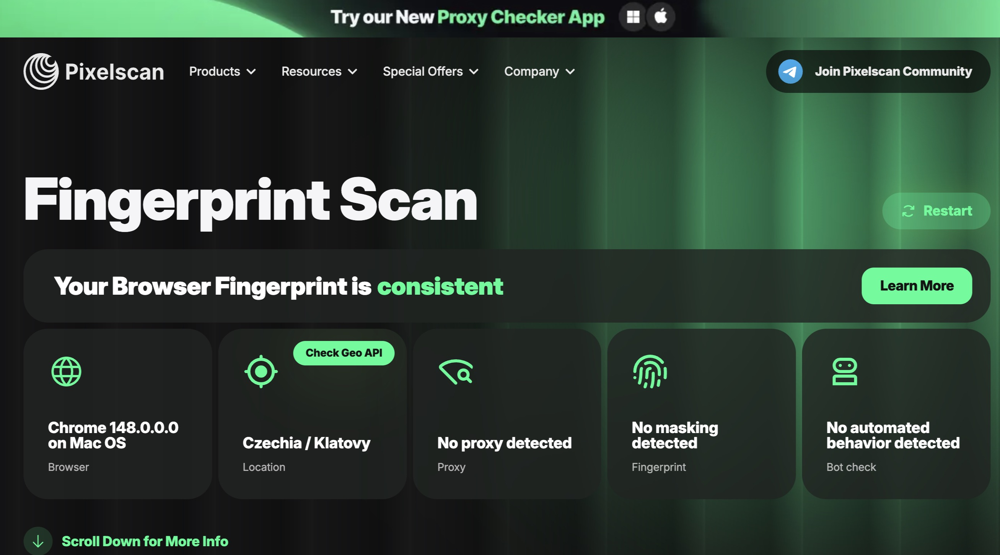
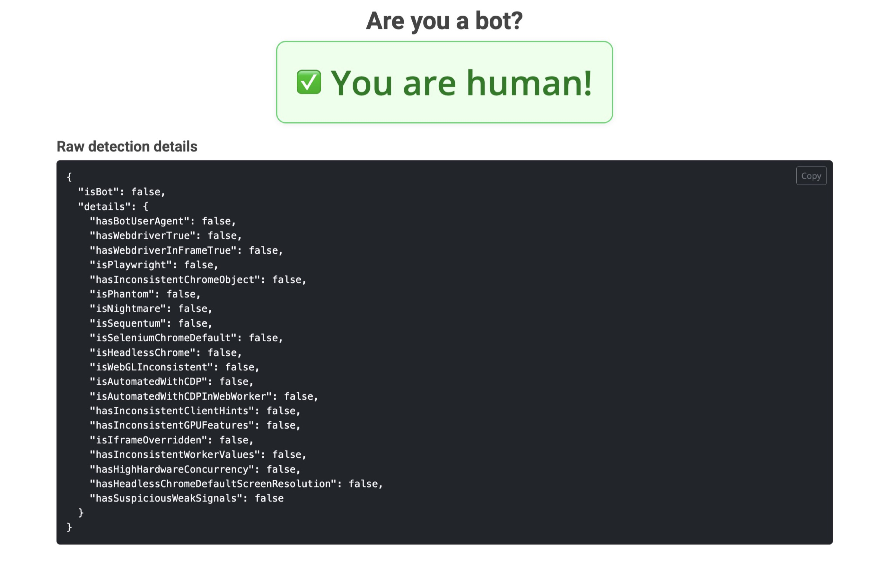
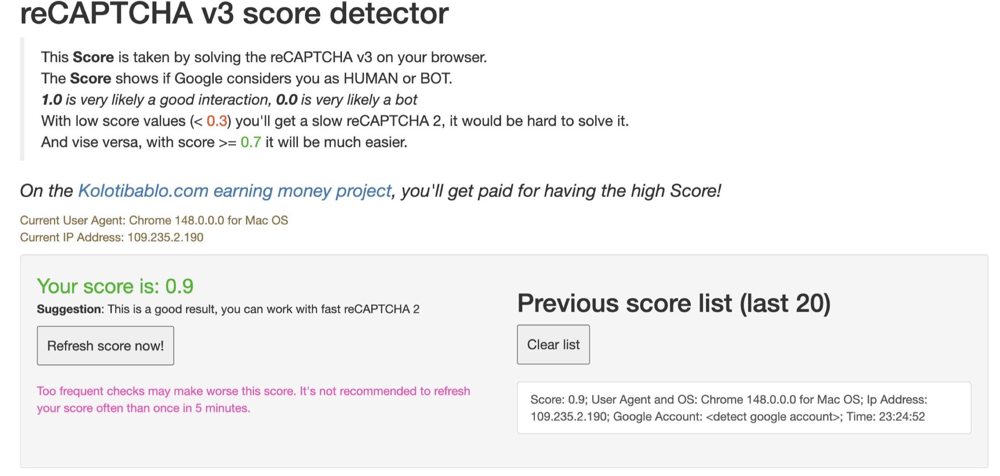

# BrProxies

[Tieng Viet](README.vn.md) | [Page](https://hoatv2211.github.io/BrProxies/)

BrProxies is a personal desktop launcher for browser profile management,
fingerprint control, proxy testing, local automation, and crawler proxy pooling.
It is developed at [hoatv2211/BrProxies](https://github.com/hoatv2211/BrProxies)
from the original [ProxyShard/ShardBrowser](https://github.com/ProxyShard/ShardBrowser)

The upstream project describes ShardX as an anti-detect Chromium launcher with
engine-level fingerprint spoofing, proxy binding, a local HTTP API, MCP support,
and Python/Node SDKs. This fork keeps that profile/proxy workflow and adds a
local Redis-backed ProxyPool sidecar for collecting and rechecking public
proxies before promoting working rows into browser profiles.

## Main Screens

| Browsers                                             | Fingerprints                                             |
| ---------------------------------------------------- | -------------------------------------------------------- |
|  |  |

| Proxies                                        | ProxyPool                                              |
| ---------------------------------------------- | ------------------------------------------------------ |
|  |  |

## What It Does

- **Profiles** - create, clone, pin, tag, organize, and launch isolated browser
  profiles.
- **Fingerprints** - edit device identity, screen, WebGL/WebGPU, locale,
  timezone, WebRTC, media devices, geolocation, and noise settings.
- **Proxies** - add HTTP, HTTPS, and SOCKS5 proxies, run TCP/UDP/geo checks, and
  bind proxies to profiles.
- **ProxyPool** - collect public proxy candidates, test live ones, store working
  records in Redis, recheck them, and add good proxies into the main proxy list.
- **Automation API** - expose a local HTTP API on `127.0.0.1:40325` with Bearer
  token auth for profile automation and CDP handoff.
- **MCP server** - export a local MCP bridge for AI clients.
- **SDKs** - Python and Node SDKs live in `sdks/`.

## Validation Screenshots

| fingerprint.com                                                    | Twilio WebRTC                                                  |
| ------------------------------------------------------------------ | -------------------------------------------------------------- |
|  |  |

| Browserscan                                                | Pixelscan                                              |
| ---------------------------------------------------------- | ------------------------------------------------------ |
|  |  |

| Haru bot detection                                                    | reCAPTCHA score                                                    |
| --------------------------------------------------------------------- | ------------------------------------------------------------------ |
|  |  |

## Quick Start On Windows

Helper scripts live in [`smart launch`](smart%20launch/):

```bat
"smart launch\build.bat"        :: build web assets + desktop app
"smart launch\run.bat"          :: start Redis, cleanup ProxyPool, run the built launcher
"smart launch\run-redis.bat"    :: start bundled Windows Redis only
```

Build and run:

```bat
"smart launch\build.bat"
"smart launch\run.bat"
```

Release exe:

```text
src-tauri\target\release\brproxies.exe
```

`run.bat` starts the bundled Windows Redis on `127.0.0.1:6380`, then calls
`cleanup-proxypool.ps1` to stop stale ProxyPool Python sidecars before opening
the app.

## Manual Build

```bash
npm install
npm run build
npm run tauri dev
npm run tauri build
```

On Windows PowerShell, use `npm.cmd` if bare `npm` is not resolved correctly.

## ProxyPool Workflow

ProxyPool runs as a local Python sidecar. It collects proxies from enabled
public sources, tests whether they work, saves passing records to Redis, and
removes dead proxies during rechecks.

Redis starts automatically when you launch the app with `run.bat`. To start only
Redis for debugging:

```bat
"smart launch\run-redis.bat"
```

Default Redis URL:

```text
redis://:madpool@127.0.0.1:6380/0
```

Typical UI flow:

1. Open **ProxyPool** and click **Connect**.
2. Click **Collect now** to crawl enabled sources and save passing proxies.
3. Click **Refresh** or **Check now** to recheck stored proxies.
4. Use **Copy** for a raw proxy string or **Add** to promote a row into the main
   **Proxies** tab. Added rows are removed from Redis so the pool shows what is
   still waiting to be promoted.
5. Filter the working table by country or source, select multiple rows, then use
   **Copy selected**, **Add selected**, or **Delete selected** for batch actions.
   Added rows are removed from Redis after they are saved.
6. Use **Clean** to clear all cached ProxyPool IPs from Redis.
7. Use **Add source** for custom text, table, or Geonode JSON proxy lists.

Public free proxy sources are unstable. Empty results can mean the source is
blocked, temporarily down, or all candidates failed live checks.

## ProxyPool API

Default sidecar URL: `http://127.0.0.1:40326`

| Method     | Endpoint                      | Purpose                        |
| ---------- | ----------------------------- | ------------------------------ |
| `GET`    | `/health`                   | service and Redis status       |
| `GET`    | `/proxy/random?https=false` | get one random working proxy   |
| `GET`    | `/proxy/pop?https=false`    | get and remove one proxy       |
| `GET`    | `/proxies?https=false`      | list working proxies           |
| `GET`    | `/count?https=false`        | count working proxies          |
| `DELETE` | `/proxy/{host}:{port}`      | delete a bad proxy             |
| `POST`   | `/clean`                    | clear all cached ProxyPool IPs |
| `GET`    | `/sources`                  | list proxy sources             |
| `POST`   | `/sources`                  | add a custom source            |
| `POST`   | `/jobs/collect`             | queue collect job              |
| `POST`   | `/jobs/check`               | queue recheck job              |

## Chrome ProxyPool Extension

The repo includes a local Manifest V3 Chrome extension in [`extension/`](extension/).
It connects to the ProxyPool sidecar at `http://127.0.0.1:40326`, lists working
proxies, and applies one proxy to Chrome through the `chrome.proxy` API.

Local load flow:

1. Run `smart launch\run.bat`.
2. Open **ProxyPool**, click **Connect**, then collect/check until working rows exist.
3. Open Chrome `chrome://extensions`, enable **Developer mode**, and click **Load unpacked**.
4. Select the repo `extension` folder.
5. Open the extension popup, click **Connect**, then use **Use**, **Rotate**, or **Direct**.

This first version allows only local Pool API hosts: `127.0.0.1:40326` and
`localhost:40326`. Remote VPS URLs should add auth and narrower runtime
permission handling before publishing.

Example:

```bash
curl "http://127.0.0.1:40326/proxy/random?https=false"
```

## Local Automation API

The launcher can expose a local API on `127.0.0.1:40325`. Enable it in
Settings, copy the Bearer token, then call endpoints from crawler code or tools.

Raw schema: [openapi.yaml](openapi.yaml)

## Repository Layout

```text
src/                  React/Vite UI
src-tauri/src/        Tauri Rust backend
proxypool_service/    Python FastAPI + Redis proxy pool service
sdks/python/          Python SDK
sdks/node/            Node SDK
mcp/                  MCP server package
smart launch/         Windows build/run helpers
docs/screenshots/     README and guide screenshots
```

## License

Launcher source is MIT licensed. The bundled/downloaded browser runtime may have
separate upstream terms inherited from the original project.
