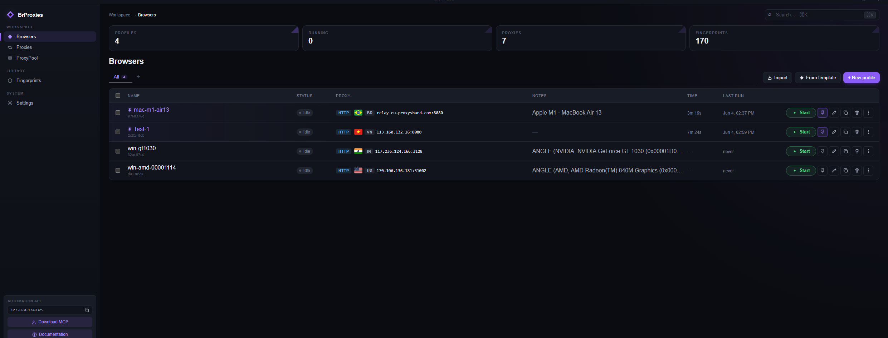
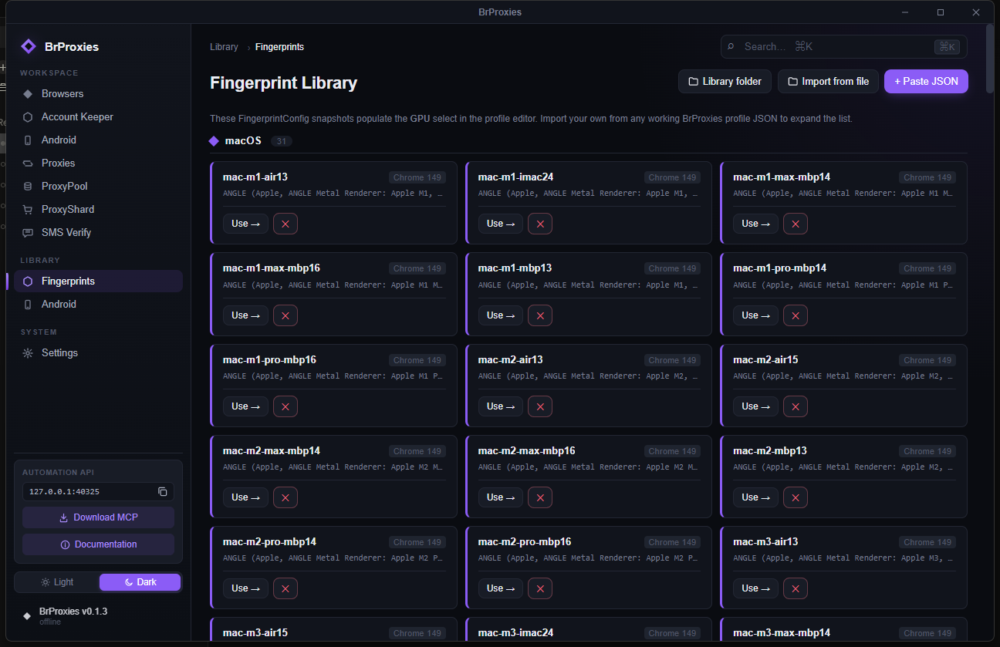
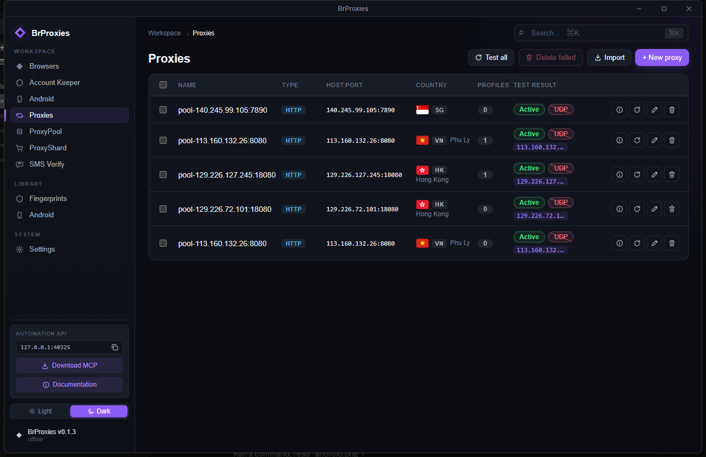
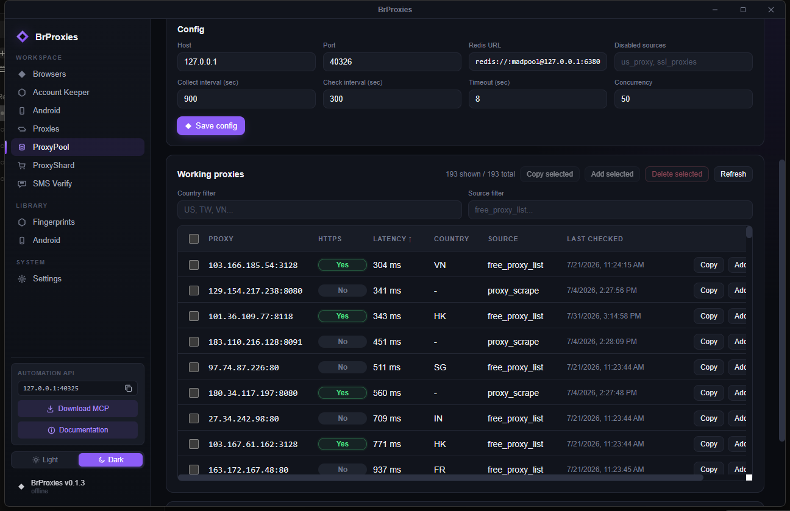

# BrProxies

[English](README.md) | [Page](https://hoatv2211.github.io/BrProxies/)

BrProxies la launcher desktop uu tien Windows de quan ly browser profile
anti-detect, fingerprint, proxy, Automation API cuc bo, ProxyPool cho crawler,
va Android instance thu nghiem.

Repo nay chua launcher, local services, SDKs, MCP server, Chrome extension va
Windows helper scripts. Browser runtime duoc tai rieng khi chay.

## Tinh nang

- **Browser profiles** - tao, clone, pin, gan tag, sap xep, va chay Chromium
  profile rieng biet.
- **Account Keeper (Windows 10/11 MVP)** - doi password cho account duoc uy
  quyen theo tung account, dung profile persistent, vault DPAPI va manual
  recovery. [English guide](docs/account-keeper.md) |
  [Huong dan tieng Viet](docs/account-keeper.vn.md).
- **Fingerprints** - chinh device, screen, WebGL/WebGPU, locale, timezone,
  WebRTC, media devices, geolocation, va noise settings.
- **Proxies** - them HTTP, HTTPS, SOCKS5 proxy, test TCP/UDP/geo, va gan proxy
  vao browser profile.
- **ProxyPool** - cao proxy public, test proxy song, luu vao Redis, recheck, va
  day proxy tot sang tab **Proxies**.
- **Android Manager** - chay Android Studio AVD that tren Windows, mo man hinh
  bang scrcpy, import device dang chay qua ADB.
- **Automation API** - HTTP API cuc bo tren `127.0.0.1:40325`, dung Bearer token
  de dieu khien browser profile tu code.
- **MCP server** - cau noi cho AI client dieu khien profile/CDP.
- **SDKs** - Python va Node SDK standalone trong `sdks/`.

## Hinh anh

| Browsers | Fingerprints |
| -------- | ------------ |
|  |  |

| Proxies | ProxyPool |
| ------- | --------- |
|  |  |

## Chay nhanh tren Windows

Script nam trong [`smart launch`](smart%20launch/):

```bat
"smart launch\build.bat"        :: smart build web assets + desktop app
"smart launch\build.bat" /full  :: build lai day du
"smart launch\build.bat" /deps  :: refresh npm + Android Manager deps
"smart launch\run.bat"          :: chay Redis, cleanup ProxyPool, mo launcher
"smart launch\run-redis.bat"    :: chi chay Redis Windows di kem
```

Build va chay:

```bat
"smart launch\build.bat"
"smart launch\run.bat"
```

File exe release:

```text
src-tauri\target\release\brproxies.exe
```

`build.bat` goi `smart-build.ps1`. Smart mode luu hash trong
`.brproxies-build-cache`, bo qua npm/Python setup neu package khong doi, chay
`npm.cmd run tauri build -- --no-bundle`, va tu dong dong `brproxies.exe` dang
chay truoc khi build release.

`run.bat` chay Redis Windows tren `127.0.0.1:6380`, goi
`cleanup-proxypool.ps1` de tat Python ProxyPool sidecar cu, roi mo app.

## Build thu cong

```bash
npm install
npm run build
npm run tauri dev
npm run tauri build
```

Tren Windows PowerShell, dung `npm.cmd` neu lenh `npm` bi loi.

## Android Manager

Android support dang dung duoc theo huong Windows AVD, nhung con moi hon browser
workflow. Thu tu runtime hien tai:

1. `windows_avd` - Android Studio AVD that tren Windows. Day la huong local dang
   ho tro.
2. `external_adb` - se lam sau de attach/import LDPlayer, BlueStacks, MEmu, hoac
   emulator nao da hien trong ADB.
3. `redroid` - de sau khi co Linux host. ReDroid khong chay native tren Windows.

Can cai tren Windows:

- Android Studio.
- Android SDK Platform Tools, Emulator, Command-line Tools.
- System image nhe: `system-images;android-35;google_apis;x86_64`.
- Nen cai `scrcpy` de mo cua so dieu khien muot hon.

Cai image khuyen nghi:

```powershell
$env:JAVA_HOME='C:\Program Files\Android\Android Studio\jbr'
$env:PATH="$env:JAVA_HOME\bin;$env:PATH"
& "$env:LOCALAPPDATA\Android\Sdk\cmdline-tools\latest\bin\sdkmanager.bat" --sdk_root="$env:LOCALAPPDATA\Android\Sdk" "system-images;android-35;google_apis;x86_64"
winget install Genymobile.scrcpy
```

Check tool:

```powershell
adb version
emulator -version
avdmanager list avd
scrcpy --version
```

Flow trong app:

1. Mo **Android**.
2. Bam **Start manager**. Nut nay chi start Android Manager sidecar.
3. Bam **Create device** de tao AVD do BrProxies quan ly.
4. Bam **Start** de boot AVD va mo man hinh bang scrcpy neu co.
5. Bam **Import devices** de import device dang chay va dang hien trong
   `adb devices -l`. Import khong lay AVD dang stop.

AVD cold boot co the mat 30-70 giay. Quick Boot snapshot giup lan sau nhanh hon.
Image `google_apis` nhe hon `google_apis_playstore`, it app rac hon, nhung AVD
van nang hon browser profile va thuong khong muot bang LDPlayer khi choi game.

## ProxyPool

ProxyPool chay bang Python sidecar cuc bo. Service lay proxy tu cac nguon public
dang bat, test proxy that, luu proxy pass vao Redis, va xoa proxy chet khi
recheck.

Redis tu chay khi mo app bang `run.bat`. Neu chi muon bat Redis de debug:

```bat
"smart launch\run-redis.bat"
```

Redis URL mac dinh cua helper desktop:

```text
redis://:madpool@127.0.0.1:6380/0
```

Nut trong UI:

- **Connect** - start/connect ProxyPool service cuc bo.
- **Collect now** - cao proxy moi va luu proxy pass.
- **Check now / Refresh** - test lai proxy dang co va tai lai bang.
- **Copy** - copy proxy song.
- **Add** - them proxy song vao tab **Proxies**, roi xoa proxy do khoi Redis.
- **Copy selected / Add selected / Delete selected** - thao tac nhieu dong.
- **Country filter / Source filter** - loc bang theo quoc gia hoac nguon.
- **Clean** - xoa tat ca IP ProxyPool dang cache trong Redis.
- **Add source** - them nguon cao proxy tuy chinh.

Proxy mien phi rat that thuong. Bang trong co the do source bi chan, source dang
loi, hoac tat ca proxy deu fail bai test.

## Chrome ProxyPool Extension

Thu muc [`extension/`](extension/) co Chrome extension Manifest V3 de lay proxy
tu ProxyPool local. Extension goi `http://127.0.0.1:40326`, hien proxy song,
test live, va set proxy cho Chrome bang `chrome.proxy`.

Cach load local:

1. Chay `smart launch\run.bat`.
2. Mo **ProxyPool**, bam **Connect**, roi collect/check den khi co proxy song.
3. Mo Chrome `chrome://extensions`, bat **Developer mode**, bam **Load unpacked**.
4. Chon thu muc `extension` trong repo.
5. Mo popup extension, bam **Connect**, roi dung **Use**, **Rotate**, hoac
   **Direct**.

## Automation API cuc bo

Launcher co the mo browser Automation API tren `127.0.0.1:40325`. Bat trong
Settings, copy Bearer token, roi goi tu crawler/tool.

Schema: [openapi.yaml](openapi.yaml)

## Cau truc repo

```text
src/                  React/Vite UI
src-tauri/src/        Tauri Rust backend
android_manager/      Python FastAPI Android Manager sidecar
proxypool_service/    Python FastAPI + Redis proxy pool service
sdks/python/          Python SDK
sdks/node/            Node SDK
mcp/                  MCP server package
extension/            Local Chrome ProxyPool extension
smart launch/         Windows build/run helpers
docs/screenshots/     README screenshots
```

## License

Launcher source dung MIT License. Browser runtime duoc tai/chay kem co the theo
dieu khoan rieng tu upstream goc.
