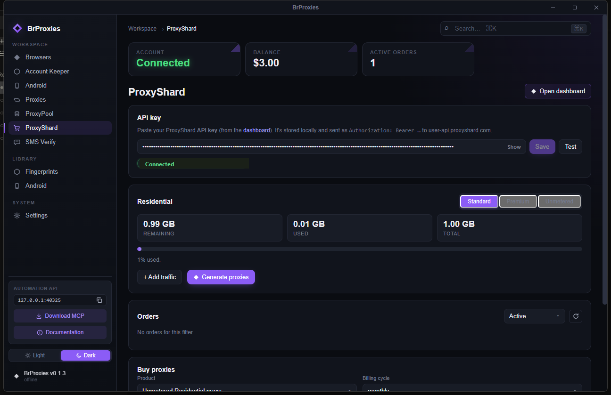
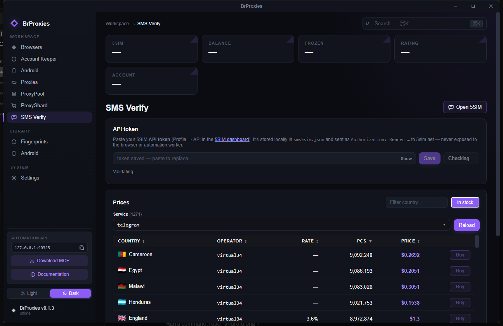
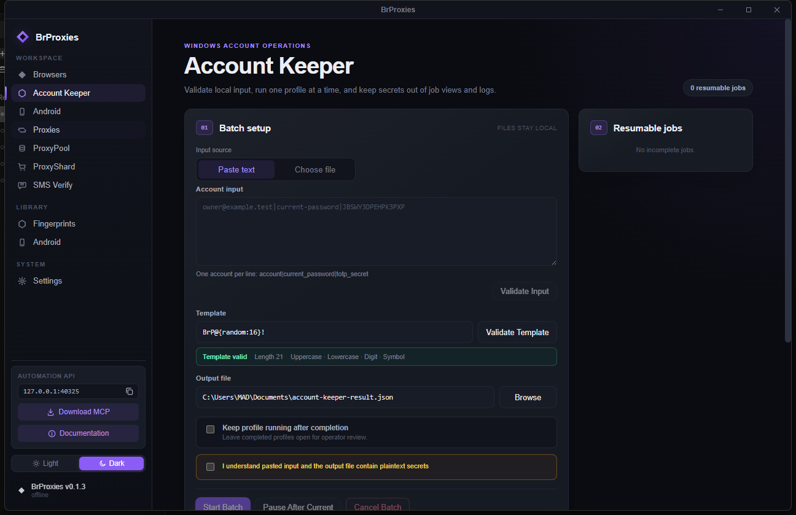
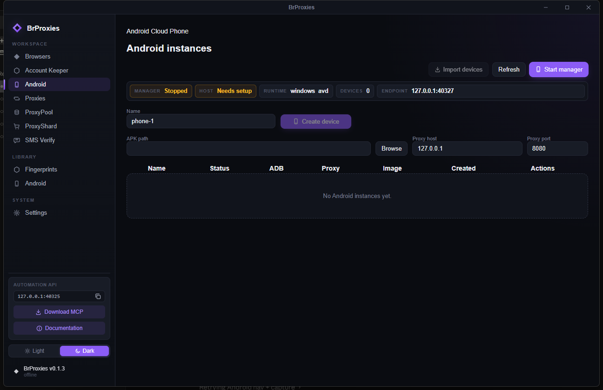
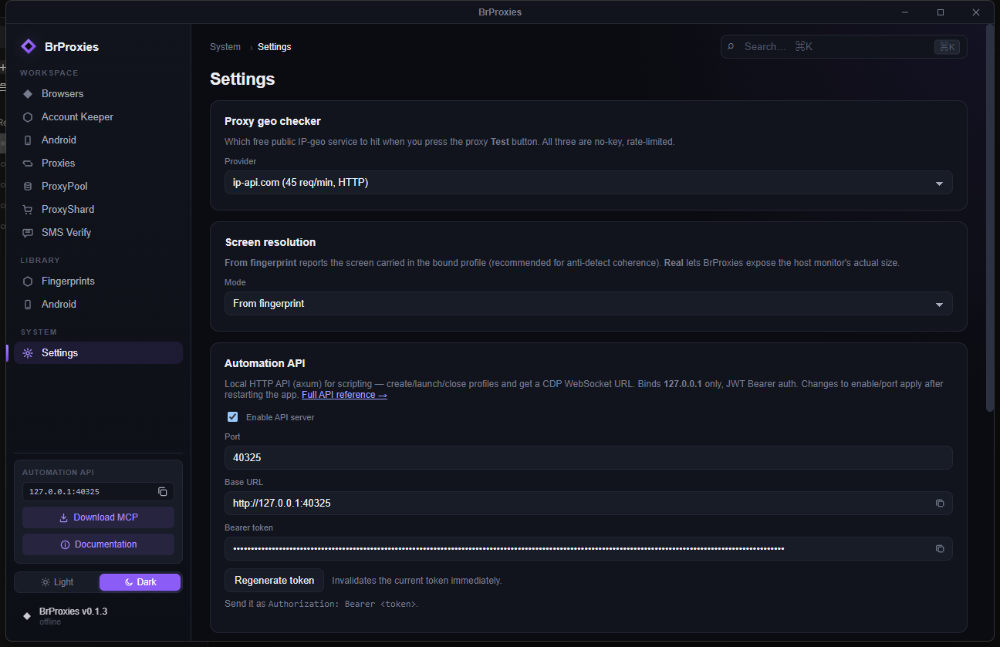

<div align="center">

# BrProxies

**Một app desktop cho anti-detect browsing với profile cách ly.**

Browser profile cách ly · fingerprint spoofing thật · hạ tầng proxy · SMS verify
· thao tác account được uỷ quyền · Automation API + MCP — gom trong một launcher
ưu tiên Windows.

[English](README.md) · [Landing page](https://hoatv2211.github.io/BrProxies/) · [hoatv2211/BrProxies](https://github.com/hoatv2211/BrProxies)


</div>

---

## Vì sao BrProxies

Chạy nhiều identity online thường phải ghép: một anti-detect browser trả phí,
một dashboard proxy riêng, một site SMS, và đống script keo dán. BrProxies gom
cả stack đó vào một app native: mỗi profile là một Chromium cách ly hoàn toàn
với fingerprint, proxy, cookie, storage riêng — và mọi phần đều điều khiển được
qua Automation API cục bộ và MCP server.

- **Cách ly thật, không phải tab group.** Mỗi profile có `user-data-dir` riêng,
  cookie persistent, proxy gắn riêng. Không rò rỉ giữa các identity.
- **Fingerprint qua được checker.** 170 device profile phủ WebGL / WebGPU /
  Canvas / audio / WebRTC / font — đã test với fingerprint.com, Pixelscan,
  BrowserScan, Twilio WebRTC (xem [bằng chứng bên dưới](#validation)).
- **Hạ tầng proxy tích hợp.** Thêm SOCKS5/HTTP của bạn với check TCP/UDP/geo,
  lấy residential từ ProxyShard, hoặc cào proxy public qua ProxyPool nền Redis.
- **Verify không cần SIM.** Thuê số, lấy mã OTP từ SMS, clear thử thách điện
  thoại — token 5SIM không bao giờ rời khỏi backend Rust.
- **Tự động hoá mọi thứ.** Automation API cục bộ + MCP server mở profile launch,
  CDP handoff, và account operation cho script và AI agent.

## Có gì bên trong

| Tính năng | Bạn được gì |
| --------- | ----------- |
| **Browser profiles** | Tạo, clone, pin, gắn tag, sắp xếp, chạy Chromium profile cách ly với proxy + fingerprint riêng. |
| **Fingerprints** | Thư viện 170 profile: device, screen, WebGL/WebGPU, locale, timezone, WebRTC, media devices, geolocation, noise. |
| **Proxies** | Thêm HTTP/HTTPS/SOCKS5, check TCP/UDP/geo, gắn proxy vào profile, xem country + latency trực tiếp. |
| **ProxyPool** | Cào proxy public, test live, lưu proxy sống vào Redis, recheck, đẩy proxy tốt sang tab chính. |
| **ProxyShard** | Mua và quản lý residential proxy (standard/premium/unmetered) ngay trong app. |
| **SMS Verify (5SIM)** | Duyệt 1.271 service với giá live, thuê số, lấy mã SMS — có countdown trực tiếp và lịch sử order/payment. |
| **Account Keeper** | Đổi password cho account được uỷ quyền, từng account một, profile persistent, vault DPAPI, manual recovery. |
| **Android Manager** | Chạy Android Studio AVD thật trên Windows, mở màn hình bằng scrcpy, import device ADB đang chạy. |
| **Automation API + MCP** | HTTP API cục bộ (`127.0.0.1:40325`, JWT Bearer) và MCP server cho script, CDP handoff, điều khiển AI agent. |
| **SDKs** | Python và Node SDK standalone để chạy runtime mà không cần app desktop. |

## Màn hình làm việc

Mười panel, một cửa sổ. Mỗi ảnh bên dưới là app thật đang chạy.

### Browser profile & fingerprint

| Browsers | Fingerprint library |
| -------- | ------------------- |
|  |  |
| Chromium profile cách ly, mỗi dòng có proxy, status, launch một chạm. | 170 fingerprint GPU/device, nhóm theo nền tảng, sẵn sàng gắn. |

### Hạ tầng proxy

| Proxies | ProxyPool | ProxyShard |
| ------- | --------- | ---------- |
|  |  |  |
| SOCKS5/HTTP với check UDP + geo. | Cào & recheck proxy free nền Redis. | Residential traffic, mua & quản lý trong app. |

### Verify & thao tác account

| SMS Verify (5SIM) | Account Keeper |
| ----------------- | -------------- |
|  |  |
| 1.271 service giá live, có cờ, countdown trực tiếp, cancel/ban. | Đổi password uỷ quyền, từng profile một, secret giữ cục bộ. |

### Mobile & hệ thống

| Android Manager | Settings |
| --------------- | -------- |
|  |  |
| AVD Android thật trên Windows, điều khiển qua scrcpy. | Geo checker, screen mode, Automation API + Bearer token. |

Repo này chứa launcher, local services, SDKs, MCP server, Chrome extension và
Windows helper scripts. Browser runtime được tải riêng khi chạy.

## Chạy nhanh trên Windows

Script nằm trong [`smart launch`](smart%20launch/):

```bat
"smart launch\build.bat"        :: smart build web assets + desktop app
"smart launch\build.bat" /full  :: build lại đầy đủ
"smart launch\build.bat" /deps  :: refresh npm + Android Manager deps
"smart launch\run.bat"          :: chạy Redis, cleanup ProxyPool, mở launcher
"smart launch\run-redis.bat"    :: chỉ chạy Redis Windows đi kèm
```

Build và chạy:

```bat
"smart launch\build.bat"
"smart launch\run.bat"
```

File exe release:

```text
src-tauri\target\release\brproxies.exe
```

`build.bat` gọi `smart-build.ps1`. Smart mode lưu hash trong
`.brproxies-build-cache`, bỏ qua npm/Python setup nếu package không đổi, chạy
`npm.cmd run tauri build -- --no-bundle`, và tự động đóng `brproxies.exe` đang
chạy trước khi build release.

`run.bat` chạy Redis Windows trên `127.0.0.1:6380`, gọi
`cleanup-proxypool.ps1` để tắt Python ProxyPool sidecar cũ, rồi mở app. Đây là
helper dành cho chạy từ source; Windows MSI đóng gói sẵn ProxyPool và Redis.

## Build thủ công

```bash
npm install
npm run build
npm run tauri dev
npm run tauri build
```

Trên Windows PowerShell, dùng `npm.cmd` nếu lệnh `npm` bị lỗi.

## Android Manager

Android support đang dùng được theo hướng Windows AVD, nhưng còn mới hơn browser
workflow. Thứ tự runtime hiện tại:

1. `windows_avd` - Android Studio AVD thật trên Windows. Đây là hướng local đang
   hỗ trợ.
2. `external_adb` - sẽ làm sau để attach/import LDPlayer, BlueStacks, MEmu, hoặc
   emulator nào đã hiện trong ADB.
3. `redroid` - để sau khi có Linux host. ReDroid không chạy native trên Windows.

Cần cài trên Windows:

- Android Studio.
- Android SDK Platform Tools, Emulator, Command-line Tools.
- System image nhẹ: `system-images;android-35;google_apis;x86_64`.
- Nên cài `scrcpy` để mở cửa sổ điều khiển mượt hơn.

Cài image khuyến nghị:

```powershell
$env:JAVA_HOME='C:\Program Files\Android\Android Studio\jbr'
$env:PATH="$env:JAVA_HOME\bin;$env:PATH"
& "$env:LOCALAPPDATA\Android\Sdk\cmdline-tools\latest\bin\sdkmanager.bat" --sdk_root="$env:LOCALAPPDATA\Android\Sdk" "system-images;android-35;google_apis;x86_64"
winget install Genymobile.scrcpy
```

Check tool:

```powershell
adb version
emulator -version
avdmanager list avd
scrcpy --version
```

Flow trong app:

1. Mở **Android**.
2. Bấm **Start manager**. Nút này chỉ start Android Manager sidecar.
3. Bấm **Create device** để tạo AVD do BrProxies quản lý.
4. Bấm **Start** để boot AVD và mở màn hình bằng scrcpy nếu có.
5. Bấm **Import devices** để import device đang chạy và đang hiện trong
   `adb devices -l`. Import không lấy AVD đang stop.

AVD cold boot có thể mất 30-70 giây. Quick Boot snapshot giúp lần sau nhanh hơn.
Image `google_apis` nhẹ hơn `google_apis_playstore`, ít app rác hơn, nhưng AVD
vẫn nặng hơn browser profile và thường không mượt bằng LDPlayer khi chơi game.

## ProxyPool

ProxyPool chạy bằng sidecar cục bộ. Service lấy proxy từ các nguồn public đang
bật, test proxy thật, lưu proxy pass vào Redis, và xoá proxy chết khi recheck.
Windows MSI đóng gói sidecar cùng Redis nên người dùng bản release không cần
cài Python hoặc chạy `run.bat`; nút **Start** tự bật Redis local nếu chưa chạy.

Khi chạy từ source, Redis tự chạy nếu mở app bằng `run.bat`. Nếu chỉ muốn bật
Redis để debug:

```bat
"smart launch\run-redis.bat"
```

Redis URL mặc định của helper desktop:

```text
redis://127.0.0.1:6380/0
```

Nút trong UI:

- **Connect** - start/connect ProxyPool service cục bộ.
- **Collect now** - cào proxy mới và lưu proxy pass.
- **Check now / Refresh** - test lại proxy đang có và tải lại bảng.
- **Copy** - copy proxy sống.
- **Add** - thêm proxy sống vào tab **Proxies**, rồi xoá proxy đó khỏi Redis.
- **Copy selected / Add selected / Delete selected** - thao tác nhiều dòng.
- **Country filter / Source filter** - lọc bảng theo quốc gia hoặc nguồn.
- **Clean** - xoá tất cả IP ProxyPool đang cache trong Redis.
- **Add source** - thêm nguồn cào proxy tuỳ chỉnh.

Proxy miễn phí rất thất thường. Bảng trống có thể do source bị chặn, source đang
lỗi, hoặc tất cả proxy đều fail bài test.

## Chrome ProxyPool Extension

Thư mục [`extension/`](extension/) có Chrome extension Manifest V3 để lấy proxy
từ ProxyPool local. Extension gọi `http://127.0.0.1:40326`, hiện proxy sống,
test live, và set proxy cho Chrome bằng `chrome.proxy`.

Cách load local:

1. Chạy `smart launch\run.bat`.
2. Mở **ProxyPool**, bấm **Connect**, rồi collect/check đến khi có proxy sống.
3. Mở Chrome `chrome://extensions`, bật **Developer mode**, bấm **Load unpacked**.
4. Chọn thư mục `extension` trong repo.
5. Mở popup extension, bấm **Connect**, rồi dùng **Use**, **Rotate**, hoặc
   **Direct**.

## Automation API cục bộ

Launcher có thể mở browser Automation API trên `127.0.0.1:40325`. Bật trong
Settings, copy Bearer token, rồi gọi từ crawler/tool.

Schema: [openapi.yaml](openapi.yaml)

## Cấu trúc repo

```text
src/                  React/Vite UI
src-tauri/src/        Tauri Rust backend
android_manager/      Python FastAPI Android Manager sidecar
proxypool_service/    Python FastAPI + Redis proxy pool service
sdks/python/          Python SDK
sdks/node/            Node SDK
mcp/                  MCP server package
extension/            Local Chrome ProxyPool extension
smart launch/         Windows build/run helpers
docs/screenshots/     README screenshots
```

<a id="validation"></a>

## Kiểm chứng

Fingerprint được test với các bộ detection public — kết quả thật từ một profile
BrProxies đang chạy, không phải ảnh dựng sẵn.

| fingerprint.com                                                    | Twilio WebRTC                                                  |
| ------------------------------------------------------------------ | -------------------------------------------------------------- |
|  |  |

| Browserscan                                                | Pixelscan                                              |
| ---------------------------------------------------------- | ------------------------------------------------------ |
|  |  |

| Haru bot detection                                                    | reCAPTCHA score                                                    |
| --------------------------------------------------------------------- | ------------------------------------------------------------------ |
|  |  |

> **Account Keeper** là workflow Windows 10/11 chỉ để đổi password cho account
> do operator sở hữu hoặc được uỷ quyền rõ ràng. Chạy từng account một, giữ
> secret trong vault DPAPI, không bao giờ đưa credential vào job view hay log.
> Xem [English guide](docs/account-keeper.md) · [Hướng dẫn tiếng Việt](docs/account-keeper.vn.md).

## License

Launcher source dùng MIT License. Browser runtime được tải/chạy kèm có thể theo
điều khoản riêng từ upstream gốc.
